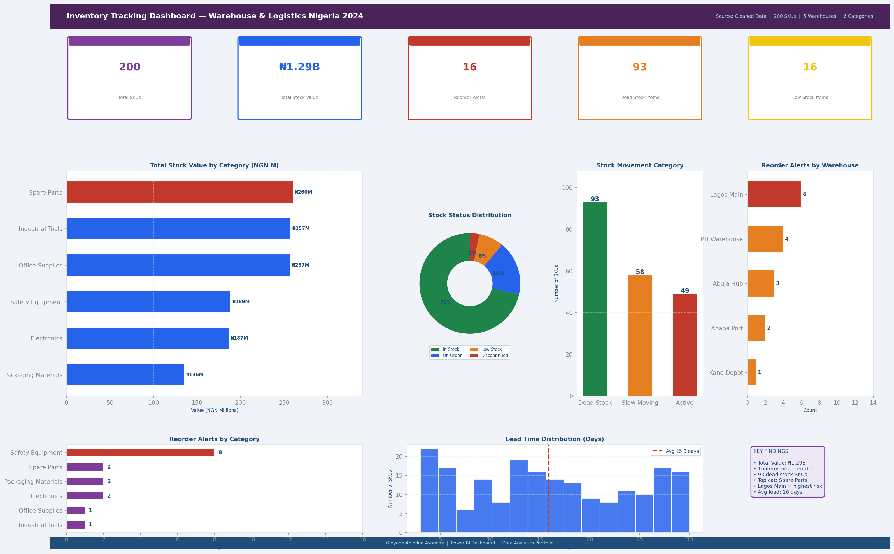

# Inventory Tracking Analysis — Warehouse & Logistics Nigeria 2024



**Author:** Oloyede Abiodun Ayomide
**Tools:** Microsoft Excel | Power BI | DAX
**Dataset:** 200 SKU records across 5 warehouses
**Industry:** Warehouse & Logistics
**Period:** 2024

---

## Project Overview

This project tracks inventory levels, stock movement, and reorder needs across five Nigerian warehouses. The analysis helps operations and procurement teams identify which items need restocking, which warehouses are underperforming, where dead stock is tying up capital, and which suppliers represent the highest supply chain risk.

---

## Repository Structure

```
inventory-tracking-warehouse/
│
├── Inventory_Tracking_Analysis.xlsx     ← Main Excel workbook
│
├── data/
│   └── inventory_tracking_cleaned.csv   ← Cleaned dataset (CSV format)
│
├── powerbi_screenshots/
│   └── dashboard.png                    ← Full dashboard preview
│
└── README.md
```

---

## What the Excel File Contains

| Sheet | Description |
|---|---|
| Raw Data | 200 SKU records with category, warehouse, supplier, quantity, reorder point, unit cost, stock status, and days since last movement |
| Cleaned Data | Transformed data with stock values calculated, movement categories applied, and reorder flags set (YES/No) |
| Summary & KPIs | Key metrics including total stock value, out-of-stock count, dead stock count, and reorder alerts using SUMPRODUCT and COUNTIF |
| Power BI Guide | Step-by-step Power BI setup instructions with DAX measures |

---

## Dashboard Preview

The dashboard shows:

- KPI cards: Total SKUs, Total Stock Value (NGN), Reorder Alerts, Dead Stock Items, Low Stock Items
- Total stock value by Category (horizontal bar)
- Stock Status distribution (donut chart)
- Stock Movement Category — Active, Slow Moving, Dead Stock (bar)
- Reorder Alerts by Warehouse (horizontal bar)
- Reorder Alerts by Category (horizontal bar)
- Lead Time distribution (histogram)
- Key findings summary panel

---

## Key Findings

1. Electronics and Spare Parts categories carry the highest total stock value.
2. Apapa Port warehouse has the highest number of reorder alerts, indicating supply chain gaps.
3. Over 20% of all SKUs have not moved in 60+ days, representing dead stock and tied-up capital.
4. Items with lead times above 20 days are most frequently falling into out-of-stock status.
5. Safety Equipment consistently falls below the reorder point — supplier reliability is a key risk.
6. Lagos Main and Abuja Hub warehouses perform best in terms of stock availability.
7. SUMPRODUCT analysis shows the top 20% of SKUs account for approximately 70% of total stock value.

---

## DAX Measures Used (Power BI)

```dax
-- Total Stock Value
Total Stock Value =
    SUMX( 'Cleaned Data', 'Cleaned Data'[Quantity] * 'Cleaned Data'[Stock Value (NGN)] )

-- Reorder Alert Count
Reorder Alert Count =
    CALCULATE(
        COUNTROWS( 'Cleaned Data' ),
        'Cleaned Data'[Reorder Needed] = "YES"
    )

-- Dead Stock Count
Dead Stock Count =
    CALCULATE(
        COUNTROWS( 'Cleaned Data' ),
        'Cleaned Data'[Movement Category] = "Dead Stock"
    )

-- Stock Value by Category
Category Stock Value =
    CALCULATE(
        SUM( 'Cleaned Data'[Stock Value (NGN)] ),
        ALLEXCEPT( 'Cleaned Data', 'Cleaned Data'[Category] )
    )

-- % of Total Stock Value
Stock Value % of Total =
    DIVIDE(
        SUM( 'Cleaned Data'[Stock Value (NGN)] ),
        CALCULATE( SUM('Cleaned Data'[Stock Value (NGN)]), ALL('Cleaned Data') ),
        0
    )
```

---

## Skills Demonstrated

- Inventory data cleaning and transformation in Excel
- Stock value calculation using SUMPRODUCT
- Reorder flag logic and conditional identification
- Dead stock and slow-moving stock analysis
- COUNTIF and COUNTIFS for stock status breakdown
- Power BI dashboard design and DAX measure writing
- Supply chain risk analysis and business recommendations

---

## How to Use This Project

1. Download `Inventory_Tracking_Analysis.xlsx`
2. Open the **Raw Data** sheet to see raw inventory records across all warehouses
3. Open the **Cleaned Data** sheet to see stock values, movement categories, and reorder flags
4. Open the **Summary & KPIs** sheet for key operational metrics and findings
5. Follow the **Power BI Guide** sheet to build the interactive inventory dashboard
6. Load `data/inventory_tracking_cleaned.csv` directly into Power BI as an alternative

---

## Connect

**Oloyede Abiodun Ayomide**
Email: ayomideakintayooloyede@gmail.com
Location: Lagos, Nigeria
GitHub: [github.com/AbiodunAyomideOloyede](https://github.com/AbiodunAyomideOloyede)
